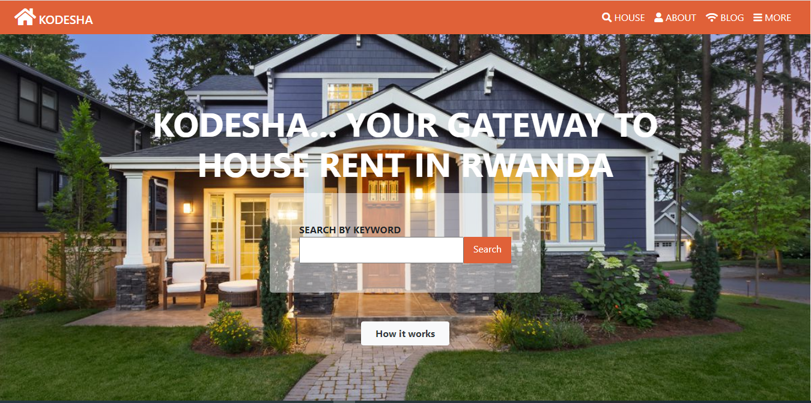
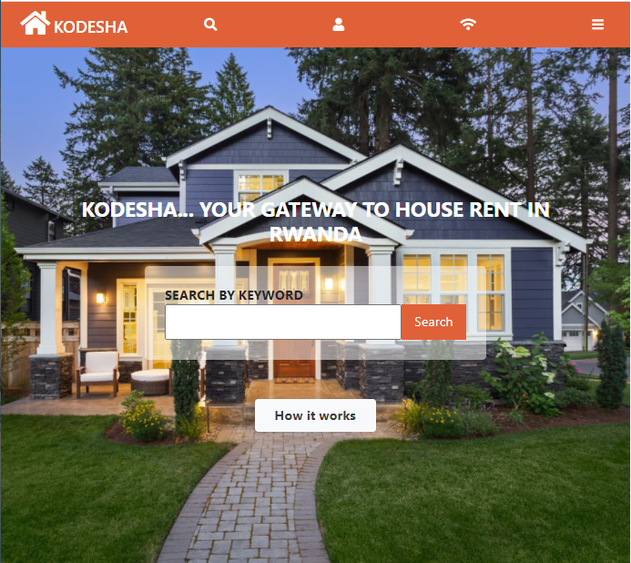
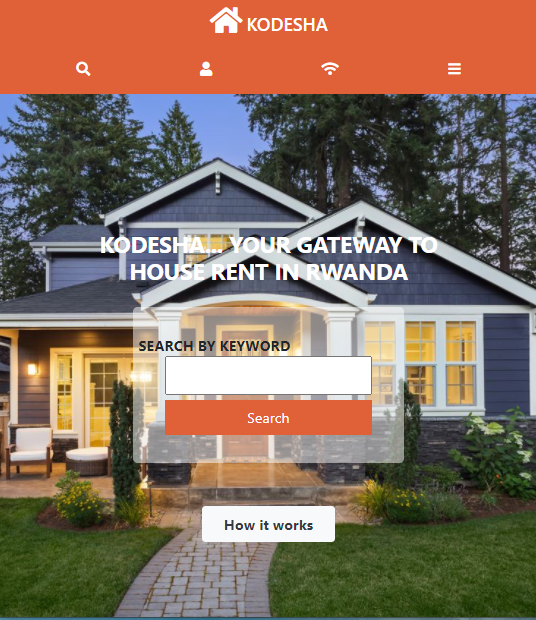

# KODESHA

> This is my capstone project for the HTML/ CSS curriculum at Microverse

## Landing page
    - Desktop view

    - Tablet view
  

    - Phone view

Additional description about the project and its features.

It is responsive across multiple devices.

## Built With

- HTML
- Bootstrap
- SASS
- Font Awesome Icons

## Authors

👤 **Ntwali Heritier**

- Github: [@githubhandle](https://github.com/NtwaliHeritier)
- Twitter: [@twitterhandle](https://twitter.com/NtwaliHeritier)
- Linkedin: [linkedin](https://linkedin.com/in/ntwali-heritier-9950001a2)

## Live Link

[Live demo](https://html-capstone.netlify.app/)

## Show your support

Give a ⭐️ if you like this project!

## Acknowledgments

- [Acknowlegment] Mathew Njuguna https://www.behance.net/mathewnjuguna
- Inspiration
- etc

## 📝 License

This project is [MIT](lic.url) licensed.
